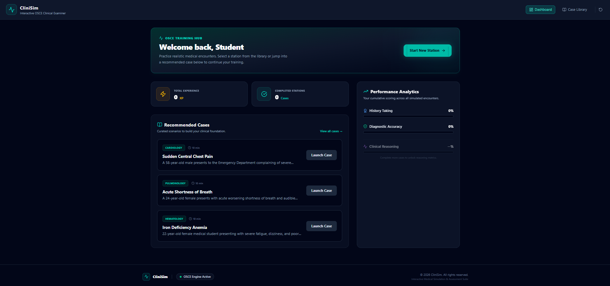
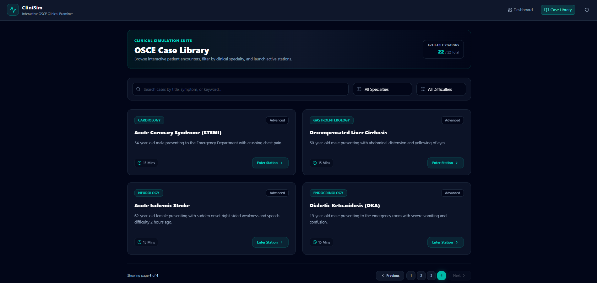
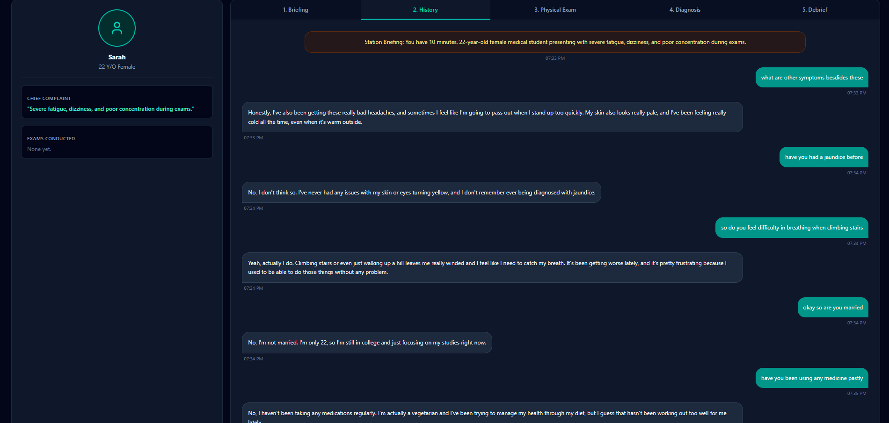
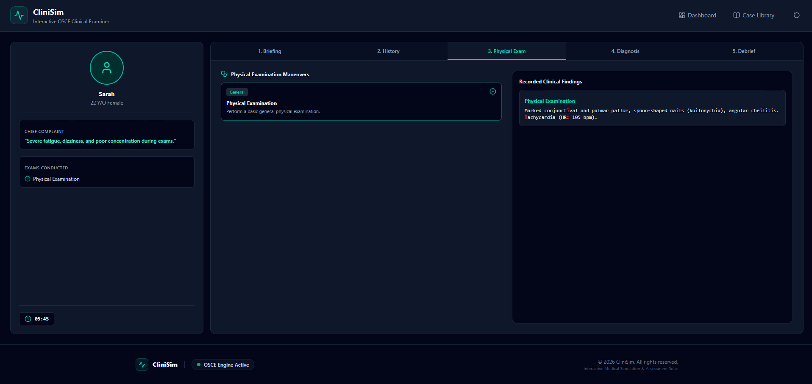
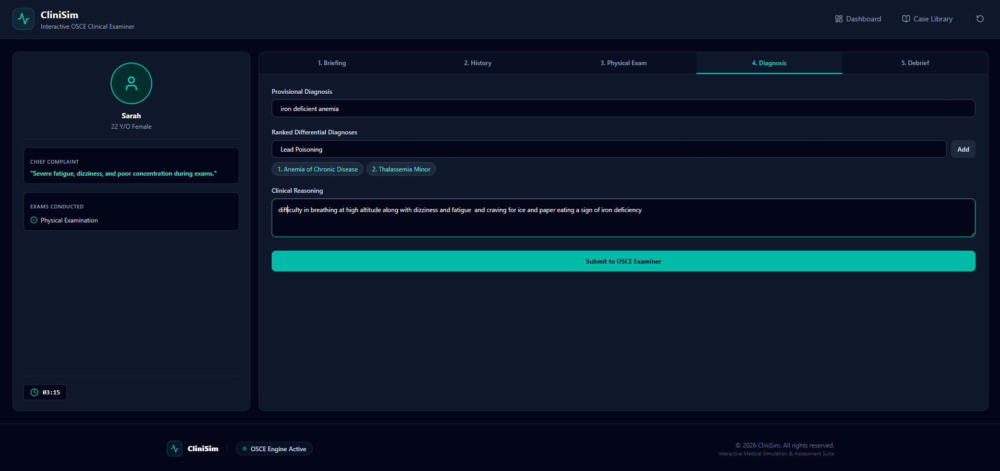

# CliniSim: Interactive OSCE Clinical Examiner

A modern, responsive web-based medical simulation and assessment suite designed for students and educators to practice Objective Structured Clinical Examinations (OSCE). Built with **React**, **Tailwind CSS**, and **Zustand**.

---

## Project Overview

### 1. App Name, What It Does, and Real Problem Solved
* **App Name**: CliniSim
* **What it does**: Provides an interactive Objective Structured Clinical Examination (OSCE) simulation environment where medical students and educators can examine patient cases, navigate clinical workflows, and test diagnostic skills with real-time AI evaluation.
* **Real problem it solves**: Traditional clinical practice resources are often static, text-heavy, or difficult to access remotely. CliniSim provides a structured, interactive digital command center for students to master clinical scenarios, time management, and diagnostic approaches on-demand.

### 2. The LIVE Deployed URL
* **Live App**: [https://clinisim.vercel.app](https://clinisim.vercel.app)

### 3. Features List
* **Interactive Case Library**: Browse, search, and filter clinical patient simulation cases by medical specialty and difficulty level.
* **Compact Pagination**: Optimized grid display showing clean blocks of cases per page with full navigation controls.
* **Responsive Command Center Navbar**: Mobile-optimized navigation drawer featuring smooth open/close transitions and phase switching.
* **Local State Persistence**: Seamless local storage management with quick-reset options for user progress and simulation data.
* **AI-Powered Virtual Patient Encounters**: Engage in realistic medical dialogue using the Groq API (`llama-3.3-70b-versatile`) to extract history of present illness, perform examinations, and formulate diagnoses.
* **Comprehensive Debrief Suite**: Post-encounter performance analysis mapping out exact correct diagnoses, required clinical findings, and missing criteria if an error occurs.
* **Medical Dashboard Aesthetic**: Tailored dark-mode UI built with Tailwind CSS, Lucide icons, and a clinical teal accent system.

### 4. The AI Feature 
* **AI Feature**: Powers intelligent patient responses, dynamic symptom evolution, and automated performance evaluation based on user inquiries during clinical encounters.


### 5. Tools, Services, and AI Models Used
* **Frontend Library**: React (with Vite)
* **Styling**: Tailwind CSS
* **Icons**: Lucide React
* **State Management**: Zustand
* **AI Model**: llama-3.3-70b-versatile via Groq API
* **Deployment & Hosting**: Vercel

### 6. Screenshots of the App in Action
<table>
  <tr>
    <td></td>
    <td></td>
    <td></td>
  </tr>
  <tr>
    <td></td>
    <td></td>
    <td></td>
  </tr>
</table>


1. **Dashboard & Overview View**: Displays active metrics, station shortcuts, and simulation status.
2. **Case Library & Filters**: Showcases the filterable grid interface with specialty/difficulty dropdowns and search inputs.
3. **Debrief Analysis Breakdown**: Displays real AI-generated correct diagnoses and missing clinical findings after encounter submission.

### 7. How to Run the Project Locally

1. **Prerequisites**: Ensure you have [Node.js](https://nodejs.org/) installed on your machine.
2. **Clone the Repository & Install Dependencies**:
   ```bash
   git clone <repository-url>
   cd clinisim
   npm install